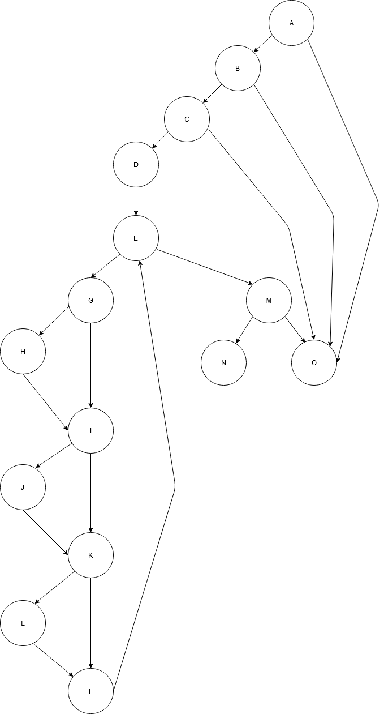

# Втора лабораториска вежба по Софтверско инженерство
___
## Стефан Митревски, бр. на индекс 183148
___
### Група на код:
Ја добив групата на код 4
### Control Flow Graph

### Цикломатска комплексност
Цикломатската комплексност на овој код е еднаква на 8. Таа ја добив преку броењето на регионите во Control Flow Graph-от и преку формулата E-N+2 каде што Е е бројот на ребра (21), а N e бројот на јазли (15). 
### Тест случаи според критериумот Every branch
За овој критериум, со помош на графот, конструирав вкупно 5 тест случаи кадешто се поминуваат сите гранки во кодот, и тоа:
Тест случај 1: Целта на овој тест е влезниот параметар за корисникот да биде коректен т.е да корисничкото име и лозинката да бидат валидни според дадените критериуми ( лозинката има повеќе од 8 карактери, не го содржи корисничкото име и содржи голема буква, специјален знак и бројка ), 
така ќе се поминат голем дел од гранките меѓутоа остануваат случаите каде параметрите за корисникот не би биле валидни, а за нив се останатите тест случаи. Гранките кои се поминуваат според овој тест случај се: 
A-B ( user не е null ) 
B-C ( username и password не се null ) 
C-D ( лозинката не го содржи корисничкото име на корисникот и е поголема од 8 знаци ) 
D-E ( се иницијализира i на 0 ) 
E-G ( секогаш кога i е помало од бројот на знаците на лозинката се изминува ова гранење ) 
G-H ( Бидејќи во лозинката има бројка ќе се измине оваа гранење ) 
G-I ( не секој знак во лозинката е бројка па така ќе се помине ова гранење ) 
I-J ( лозинката содржи барем еден знак што е голема буква ) 
I-K ( не сите знаци во лозинката се големи букви ) 
K-L ( лозинката содржи специјален знак ) 
К-F ( не секој знак е специјален знак па одма се преминува на инкрементот на i ) 
L-F ( кога ќе наидеме на специјален знак преминуваме према инкрементот на i ) 
F-E ( после секој инкремент се враќаме на јазелот Е за проверка на условот за овој for циклус ) 
Е-М ( ова се случува бидејќи евентуално ќе ја изминеме целата лозинка ) 
M-N ( ова гранење се случува бидејќи лозинката содржи и голема буква и бројка и специјален знак ). 
Гранењата кои преостануваат се А-О, B-O, C-O и М-О и сите се обработени во наредните тест случаи. 
Тест случај 2: Во овој тест случај корисникот е null и од јазелот А веднаш ќе се премине према јазелот O и со овој тест случај е покриено ова разгранување. 
Тест случај 3: Тука корисникот би имал или null за корисничкото име или за лозинката, не е важно за кој параметар станува збор дека е null, тука се преминуваа од јазелот B во јазелот О. 
Тест случај 4: Овој тест случај е наменет за преминување од јазелот C во О каде лозинката на корисникот го содржи неговото корисничко име или лозинката има помалку од 8 знаци. 
Тест случај 5: Тука преминуваме од јазелот М до јазелот О со тоа што лозинката на корисникот или не содржи голема буква или специјален знак или бројка. 
### Тест случаи според критериумот Every statement
За овој критериум, од друга страна пак, целта е да се поминат сите јазли од графот а за тоа ми беа потребни само 2 тест случаи каде двата тест случаи се првите два од Every branch критериумот. 
Тест случај 1: Сите параметри за корисникот пратен во аргументот се валидни според предефинираните услови ( содржи валидно корисничко име и лозинка каде лозинката има повеќе од 8 карактери, не го содржи корисничкото име и содржи голема буква, специјален знак и бројка )
и се поминуваат 93% од јазлите односно не се поминува само јазелот О. 
Тест случај 2: Тука корисникот пратен како аргумент е null и веднаш ќе се оди на јазелот О. 
### Објаснување на напишаните unit tests
Unit тестовите ги напишав со тоа што најпрво направив тест класа и во неа дефинирав 2 функции, една за Еvery branch, а другата за Every statement критериумот. Во оваа класа инстанцирав објект од класата SI_Lab2 со име example кој го употребував во тестовите.
Во двете функции за тестирањето употребував само assertions од типот assertTrue и assertFalse соодветно бидејќи функцијата која се тестира враќа boolean.

Објаснување за everyBranch() функцијата: 
Првиот тест случај каде корисникот содржи валидни параметри: 
assertTrue(example.function(new User("test", "P@ssw0rd1", "email@email.com"), null)); 
Вториот тест случај каде корисникот е null: 
assertFalse(example.function(null, null)); 
Третиот тест случај каде корисничкото име е null: 
assertFalse(example.function(new User(null, "P@ssw0rd1", "email@email.com"), null)); 
Четвртиот тест случај каде во лозинката на корисникот се содржи неговото корисничко име: 
assertFalse(example.function(new User("test", "P@ssw0rd1test", "email@email.com"), null)); 
Петтиот тест случај каде лозинката не содржи специјален знак, голема буква и бројка: 
assertFalse(example.function(new User("test", "Password1", "email@email.com"), null)); 

Објаснување за everyStatement() функцијата: 
Првиот тест случај каде корисникот содржи валидни параметри: 
assertTrue(example.function(new User("test", "P@ssw0rd1", "email@email.com"), null)); 
Вториот тест случај каде корисникот е null: 
assertFalse(example.function(null, null)); 